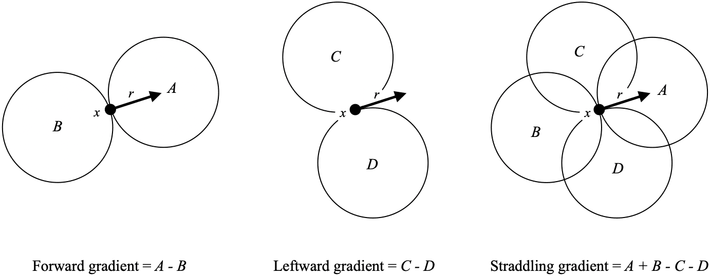
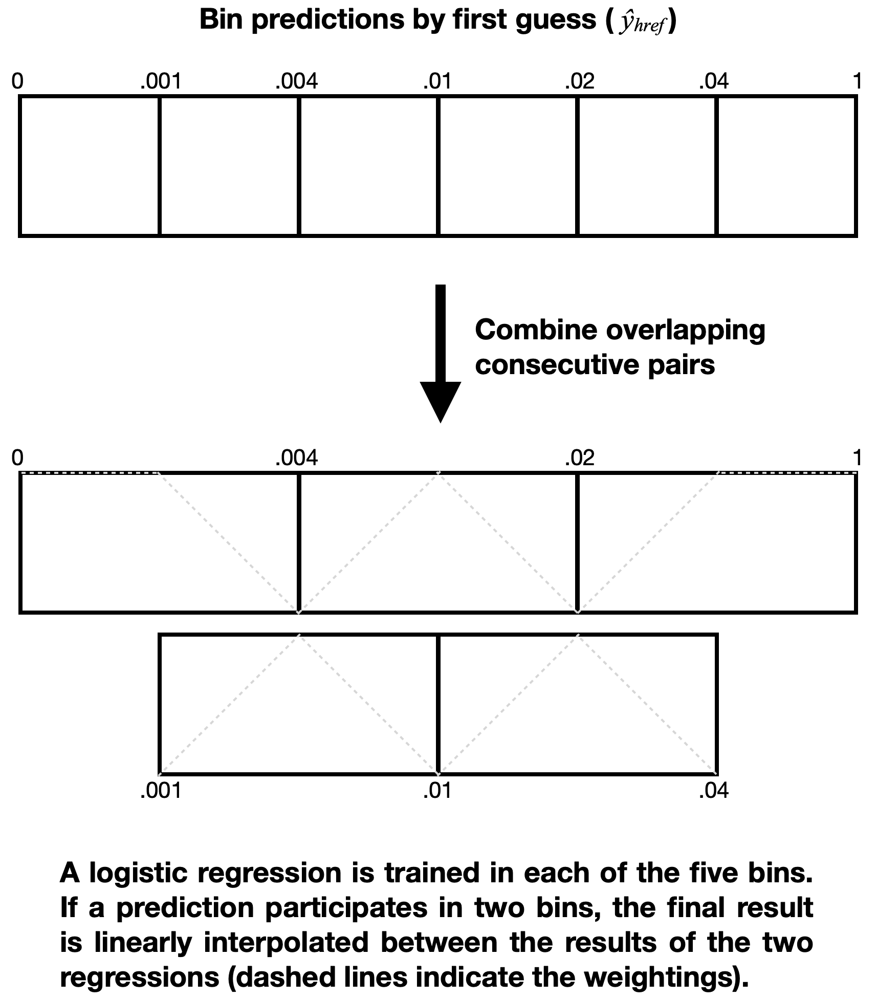

# Nadocast - CONUS Severe Weather Probabilities via Feature Engineering and Gradient Boosted Decision Trees

Day tornado outlooks are published on [nadocast.com](http://nadocast.com). All severe hazards and hourly and 4-hourly probabilities are published on [data.nadocast.com](http://data.nadocast.com).

Two models are currently running:

1. **The "2020" models** predict tornadoes based on training data through 2020. 0Z forecasts use the [HREF](http://nomads.ncep.noaa.gov/txt_descriptions/HREF_doc.shtml) and [SREF](https://nomads.ncep.noaa.gov/txt_descriptions/SREF_doc.shtml). 10Z, 14Z, and 20Z intraday updates additionally incorporate the [HRRR](https://rapidrefresh.noaa.gov/hrrr/), and [RAP](https://rapidrefresh.noaa.gov/).
2. **The "2021" models** predict tornadoes, severe wind, severe hail, and significant severe hazards based on training data through 2021. Only the HREF and SREF are used. 0Z, 12Z, and 18Z forecasts are published. The 0Z and 12Z guidance is available internally to SPC forecasters as one of several experimental ML products.

The below describes the "2021" models, but the feature engineering and overall setup for the "2020" models is essentially the same.

## Background

Nadocast began because I (Brian Hempel) wanted to go tornado chasing but knew nothing about meteorology. Back in 2018, the SPC did not produce day 2 tornado probabilities, so I had to stay up until 1am waiting for the day 1 outlook to know if it was worth storm chasing the next day. Additionally, weather forecasting was rarely utilizing state-of-the-art machine learning, but in many domains ML had met or exceeded human performance—why not tornado prediction?

I also wanted hourly predictions so I could know when in the day to chase, so Nadocast was conceived as an hourly predictor.

I was pretty naive at the time about how precise the numerical weather models were, as well as the computation requirements of the problem, but after about three attempts Nadocast started producing outlooks that were competitive with the SPC. That was around the summer of 2021. The "trick" was to add more and more and more features, with more negative data (non-events), as described below.

Because the goal of Nadocast was to maximize prediction performance above that of human-generated forecasts, some tradeoffs were made at the cost of simplicity and elegance. Nadocast is not simple. Some of the feature engineering choices described below might be considered "sloppy" or unscientific, but the expectation was that the learning algorithm would choose helpful features and ignore unhelpful ones.

## Methodology

Input data for training is sourced from an archive of the CONUS HREF and SREF ensemble mean and probability summary files that I have been collecting for several years. The earliest date in the HREF archive is 2018-6-29, and the earliest date in the SREF archive is 2019-1-9 (before this date I didn't grab all the right files). The archive ran out of free storage space on 2020-10-18 and is missing data from then until 2021-3-16 when more space was made available.

The goal is to predict the three types of convective severe weather hazards for which the [Storm Prediction Center (SPC)](https://www.spc.noaa.gov/) issues hazard-specific outlooks: tornadoes, wind, hail. [NOAA's Storm Events Database (Storm Data)](https://www.ncdc.noaa.gov/stormevents/) provide the historical record from which we derive six training targets, shown in the table below. For each of the three hazard types, there are two separate training targets: "severe" events, and more damaging "significant severe" events, based on [the definitions used by the National Weather Service and the SPC](https://www.spc.noaa.gov/misc/about.html).

| Storm Data Event Type | Severe Threshold | Significant Severe Threshold |
| --------------------- | ---------------- | ---------------------------- |
| Tornado               | ≥EF0             | ≥EF2                         |
| Thunderstorm Wind     | ≥50 knots        | ≥65 knots                    |
| Hail                  | ≥1 inch          | ≥2 inches                    |

For the hourly forecasts, a point is given a positive label if it is within ±30 minutes of the hour and within 25 miles (40km) of a point (the distance used by the SPC for their convective outlooks).

The spatial domain of the HREF CONUS grid is larger than the grid of its smallest member, so there are large regions on the edge of the domain with no data. On input, the HREF files are first cropped to remove these regions and to better fit the CONUS. The cropping also considerably speeds processing in later steps. The original 5km grid is resampled to a 15km grid by taking the mean of 3x3 blocks. The SREF input files are cropped to match, but are not resampled and retain their 40km grid.

### Feature Engineering

Nadocast performs several steps of feature engineering on the input files: additional parameters are computed from the ensemble mean fields, then spatial means of various radii are computed for all fields, then spatial gradients over various scales. All these parameters from the prior and following forecast hour are concatenated, as well as the min, mean, max, and change over the three hour window. Finally, several fields describing the spatial climatology of storm events are added. For the HREF, this feature engineering expands the initial 58 ensemble mean and 80 ensemble probability fields into 17412 fields for learning (summarized in [Table 1](#table-1)). Similarly, the SREF's 72 mean and 96 probability fields are expanded into 18777 fields for learning. The initial fields and these steps are described in more detail below. We will give somewhat less detail about the SREF pipeline because the final predictions are derived mostly from the HREF in the final weighting

#### Initial Fields

A random sample of 500 forecast hours from the training data was used to determine which fields the input files have in common over the time period. For the HREF, 58 ensemble mean and 80 ensemble probability fields are present over the time period of the dataset ([Table 2](#table-2) and [Table 3](#table-3)), for the SREF, 72 mean and 96 probability field are available for use (not listed). Most notably, only one updraft helicity (UH) field is available to the HREF models. The convection allowing models (CAMs) that make up the HREF explicitly simulate storm updrafts. UH indicates the amount of spin of these updrafts and is a key parameter inspected by human forecasters when predicting severe weather. The only UH parameter available across the whole dataset is the probability of UH >25m²/s², which is a low threshold. When the third version of the HREF was operationalized in May 2021, a >100m²/s² threshold in the HREFv2 was removed and replaced with >75m²/s² and >150m²/s² thresholds, leaving only the >25m²/s² in common throughout the period of the training data. Other automated guidance relies heavily on UH[^stpcalcircle][^srefsseo][^lokenrf], but Nadocast has less access to that information.

#### Computed Parameters

The initial HREF fields include information about wind shear, thermodynamics, and simulated storm attributes, but do not include composite environmental parameters such as the significant tornado parameter (STP) or supercell composite parameter (SCP)[^stpscp]. To give the learning a head-start on some of this environmental information, a number of STP-inspired sub-terms are computed ([Table 4](#table-4)). The computed terms differ slightly from their definitions in the literature because not all the required information is directly available in the HREF mean fields, e.g. only 0-3km storm relative helicity (SRH) is available, whereas STP calls for 0-1km SRH. Additionally, multiple alternate versions of the terms are computed with both mixed-layer CAPE (MLCAPE) and surface-based CAPE (SBCAPE), as well as with the square root of each, inspired by the finding of Togstad et al.[^togstad] that sqrt(MLCAPE) * (0-6 bulk wind difference) was better than MLCAPE * (0-6 bulk wind difference) at discriminating between non-tornadic supercells and supercells producing significant tornadoes.

Wind divergence, convergence-only (divergence with diverging regions set to 0), and vorticity are computed at several pressure layers ([Table 4](#table-4)), as well as the divergence difference between the 250mb and 850mb layers. Subjectively, earlier Nadocast versions seemed to have trouble on days with discrete supercells, such as when supercells form on a front and move off it. Storm mode is related to how long the storm stays in the region of convective forcing[^dialmode]. To estimate the prior convective forcing a storm was subject to, we computed the mean convergence and differential divergence 3, 6, and 9 hours upstream by storm motion from each point. Only forcing up to the initiating boundary are relevant to storm, so the convergence and differential divergence are set to 0 where SCP < 0.1 along the upstream path. Since the goal is to estimate regions where supercells could get ahead of fronts, the final computed mean upstream forcing is set to zero when SCP < 1. Further details of the computation are somewhat sloppy: we use the ensemble mean 700mb winds as the storm motion estimate (because they are immediately available) and we follow those winds upstream on the same forecast hour rather than consulting prior hours (which would be computationally inconvenient).

To estimate parameters of the inflow winds, we similarly take the mean SBCAPE, MLCAPE,  2m dewpoint, and categorical rain (0 for no rain, 1 for rain) 1 and 2 hours upstream of each gridpoint by the ensemble mean 925mb winds. As before, these computations are done on the same forecast hour for convenience.

In total, all of the above computations add 53 fields to the initial 133 HREF fields. Similar computations for the SREF add 38 fields to its initial 168 fields—fewer additional because of differing initial fields available, for example the SREF only has SBCAPE and lacks MLCAPE.

#### Spatial Means

From all initial and computed fields, spatial means are computed using radii 25, 50, and 100 miles. The means are computed by taking a simple (non-Gaussian) mean of all points with the given distance of every point. The spatial means are appended to the existing fields, increasing the total number of fields by a factor of four.

#### Spatial Gradients

In hopes of allowing the model to tell whether storms are moving along or off a front, several spatial gradients are computed relative to the storm motion. Storm motion is not among the HREF ensemble mean fields, so storm motion is estimated as the mean wind below and including the 500mb level (non-pressure-weighted). which itself is an estimate of the advective-only component of Bunkers storm motion (0-6km mean wind, non-pressure weighted)[^bunkers]. As shown below, three kinds of gradients are computed, each by examining the $r$-mile mean at different points $r$ miles from the point of interest $x$.

Forward gradients are computed by taking the mean value ahead of the storm and subtracting the mean value behind. Leftward gradients take the mean value to the left of the storm and subtract the mean value to the right. Straddling gradients add the mean values ahead and behind the storm and subtract the mean values to the sides. Each gradient is calculated for $r$ = 25, 50, and 100 miles, utilizing the spatial means calculated in the prior step for efficiency.

For the HREF and SREF, these computed gradients total 1719 and 1854  fields for a total of 2483 and 2678 fields, respectively.

#### Rotationally-Invariant Winds

To allow the learning model to examine the hodograph in a rotationally invariant fashion, all wind fields are rotated relative to a shear vector over part of the hodograph. For the HREF, this shear vector is roughly the 900mb to 550mb shear, computed as follows: $0.75\cdot{}wind_{925mb} + 0.25\cdot{}wind_{850mb}$ for one end of the shear vector and $0.25\cdot{}wind_{700mb} + 0.75\cdot{}wind_{500mb}$ for the other. All winds are rotated such that this vector becomes eastward. This vector was chosen because it captures an interesting region of the hodograph and is similar to the shear from the 0-0.5km mean wind to 5.5-6km mean wind used as part of the calculation of Bunkers storm motion[^bunkers]. After rotation, all wind fields are re-centered relative to the 0-500mb mean wind used previously for the gradient calculations.

#### Three Hour Windows

To handle uncertainty about storm timing and to capture the time-based evolution at a point, the prior and following hours are utilized as follows. All of the above fields from the prior hour and following hour are appended. Additionally, four summary parameters are computed for each of the above fields: the 3-hour minimum, mean, and maximum for all parameters, as well as the overall change from the prior to the following hour.

All of this information from the surrounding hours increases the total number of fields by a factor of seven.

#### Report Climatology

The chance of a severe weather report varies not only based on the weather itself but also on other factors such as population density[^potvin][^wendt][^widen] and regional variation in reporting practices[^weiss2002]. The discrepancy between the meteorology and the reports is particularly egregious for severe wind. The eastern CONUS generates the most severe wind reports—most of these are estimates based on observed damage to e.g. trees and power lines—but measurements from permanent weather stations show that the plains are much more prone to actual severe wind gusts than the east[^smithwind].

To give the model some insight into these regional biases and the climatological tendencies of different areas, we computed multiple background climatologies over 1998-2013: a time period solidly in the WSR-88D Doppler radar period while also preceding all of the training data (including the RAP and HRRR data used for training previous models). We computed at total of 31 climatologies, listed in [Table 5](#table-5). Each climatology is spatial-only or time-only. 

Spatially, for each severe and significant severe hazard, we computed the mean day-long probability of a report within 25 miles. We did the same for any severe, and significant severe, hazard. Because the decision trees are going to focus on areas of severe weather, we also included the probability of each severe hazard given that there was any severe report that day, e.g. $p(tornadoDay | severeDay) = \frac{p(tornadoDay)}{p(severeDay)}$. And since during learning the most useful probability may be somewhere in between, we also add the geometric mean of the absolute and conditional probabilities.

Time-wise, we computed the mean probability of any severe report within 25 miles and ±30 minutes given only the hour of day, but agnostic to the position within the CONUS. These probabilities are low (between 0.02% and 0.17%), but capture the overall diurnal trend. The diurnal trends for the individual hazards are similar to each other, so only the overall severe trend is included.

To capture seasonal variation, we computed the day-long probability of a report within 25 miles given only the month of year, agnostic to the position with the CONUS. These probabilities were computed for any  (non-significant) hazard. We also computed the conditional probability of each (non-significant) hazard given that there was a severe event that day, given the month.

#### Feature Engineering Summary

In total, the feature engineering steps above result in 17412 fields (features) per point per hour for training on the HREF (summarized in [Table 1](#table 1)), and 18777 fields for training on the SREF. As we now discuss, from these features we train hourly models for the HREF and SREF separately, and then combine and calibrate their predictions.

### Training, Calibrating, and Combining Hourly Models

For training we all the daily model runs (0Z, 6Z, 12Z, and 18Z for the HREF and 3Z, 9Z, 15Z, and 21Z for the SREF). The training set consists of all valid hours during weekdays (by convective day), with Saturdays reserved for validation and calibration, and Sundays reserved for final testing. The input files in the archive include forecast hours 1 through 36 for the HREF and 1 – 39 for the SREF, but because of the three-hour windows we can only produce forecast hours 2 through 35 (HREF) and 2 through 38 (SREF). As described previously, the training targets are each defined as at least one report ±30 min from the valid time (the center of the window).

Uncertainty increases at longer lead times. To capture this, and to perhaps use different features that are more reliable at longer lead times, we trained three models each for the HREF and SREF. The three different HREF models cover forecast hours 2-13, 13-24, and 24-35, for the SREF the models cover hours 2-13, 12-23, and 21-38. These ranges are each a multiple of 6 in length so that, as forecast runs are 6 hours apart, each of the models sees an event the same number of times as other events. For example, an event at 5Z will be seen twice by the f2-13 model: as 0Z +5 and 18Z +11. All other events will also been seen twice. Were the ranges not a multiple of 6, some events would be over or underrepresented relative to other events. Finally, if a forecast hour is covered by two overlapping models (e.g. forecast hour 13 if covered by both the f2-13 and f13-24 models) then the mean output of the two models will be used for the final predictions.

#### Gradient Boosted Decision Trees

The learning algorithm for Nadocast is gradient boosted decision trees (GBDTs). GBDTs are strong learners for binary classification (predicting yes/no outcomes), and are often used in winning entries in machine learning contests[^xgboost1][^xgboost2]. GBDTs are an ensemble of decision trees where trees are learned in sequence: each tree is trained to reduce the loss *after* the prediction from the prior trees has been applied to the data. This scheme differs from random forests, in which trees are trained in parallel (on resamples of the data) rather than in series. By learning in series, later trees can compensate for the predictions of earlier trees. Both GBDTs and random forests produce an ensemble of decision trees that operate in exactly the same manner at prediction time.

GDBT learning is also fast and therefore amenable to hyperparameter tuning to increase performance of the learned model. The caveat is that the entire dataset must fit into memory. Fast gradient boosting libraries such as LightGBM[^lightgbm] bin the input data down to a single byte per value, which both saves memory and speeds learning considerably. At the time of this project's inception, however, the popular gradient boosting libraries did not support loading data from a memory-efficient form on disk. Consequently, we wrote our own gradient boosting library[^mctb] which allows us to control data binning and data loading so that we can use all the machine-available memory without, e.g., doubling the needed memory while copying an array from the source to the learning library. Our library additionally supports parallelism through both multithreading and distributed computing.

#### Data Binning

Efficient tree learning requires transforming the input data from floating point down to single bytes. We use 255 bins per feature. For each model, bins are chosen based on a random sample of 300 forecasts that have severe reports, 50 forecasts for each of the 6 hazards. Because severe events are rare and may represent a rare portion of the parameter space, we would like to make sure this portion of the parameter space is well-represented in the bins. For each hazard, we randomly choose an equal number of positively labeled and negatively labeled points. Combining these samples, we define 255 bins for each feature based on the percentiles of the combined sample.

#### Data Subsetting

Even with the data values binned down to a single byte, the datasets are still too large to use all the data for learning. We take a random subsample of the datapoints, retaining more datapoints closer to storms as follows:

- All points with 25 miles and ±30 minutes of any severe report are retained (i.e. all points that are positive for at least one of the hazards).
- All points with 100 miles and ±90 minutes of any severe report are retained with a probability of 0.4 for the HREF models. (0.26 for SREF f2-13 and f12-23, 0.17 for SREF f21-38.)
- All other points are retained with a probability of 0.026 for the HREF models. (0.26 for SREF f2-13 and f12-23, 0.17 for SREF f21-38.)

We use weighted learning to compensate for the discarded points. Points are initially weighted based on the 2D area of their gridpoint (since gridpoint spacing is not precisely uniform). Retained points are re-weighted by the inverse of the probability with which they were retained: a point retained with probability 0.4 is re-weighted by a factor of $\frac{1}{0.4}$ = 2.5x, a point retained with probability 0.026 is re-weighted by a factor of $\frac{1}{0.026}$ ≈ 38x. Retained points thus serve to represent discarded points and the total weight of the entire dataset is effectively unchanged.

Additionally, because all points with a positive label for any severe hazard are all retained, we can reuse the same dataset to train a different predictor for each hazard, by varying only the labelling.

Feature engineering, binning, and data subsetting  was performed on two Dell T7600 workstations purchased via eBay, each with 2x 8-core Intel Xeon E5  v1 processors and 256GB of RAM. The dataset generation does not require so much RAM, as the binned and subsetted data is saved to disk after each individual forecast is processed.

Over the period of the archive, the training set from each model is generated from ~18700 hourly forecasts and the validation set from ~3800 forecasts (~16000 training and ~3300 validation for SREF f2-13 and f12-23, and ~24000 training ~4900 validation for SREF f21-38), resulting in about ~28 million and ~5.8 million datapoints after subsetting, respectively (a little less for the SREF). The training data, validation data, and six hazard labels total about 0.5 terabytes for each of the forecast hour ranges, ~3TB in all.

#### Training

Logloss (also called binary cross-entropy) was used as the loss function. Training and hyperparameter search was performed on a supercomputer, with each job using 22-25 nodes with 32GB RAM and 20 cores each. Training utilized early stopping to avoid overfitting: for each candidate set of hyperparameters, training concluded once 20 consecutive trees were added to the ensemble without improving logloss on the validation set (those 20 trees are then removed from the ensemble). Hyperparameter search is initialized with 20 random hyperparameter sets, the best of which is refined by coordinate descent: for each hyperparameter, its neighboring candidate values are tried until a local minima for that parameter is reached, and then the next hyperparameter is handled similarly and so on. Coordinate descent will perform up to two full passes across all the hyperparameters.

36 decision tree ensembles were trained (6 hazards * 3 lead times = 18 models ensembles for the HREF and SREF). The learning rate was set 0.063. Early stopping resulted in ensembles of between 158 and 754 trees (mean 350.0). Each of the ensembles ended up using a different set of hyperparameters, but in general, using fewer features was preferred (for learning each tree, only a random subset of features is considered—the size of the subset is a hyperparameter), and deeper trees were preferred (relative to the max depth of 8). The significant tornado ensembles are an exception: they were usually shallower trees.

#### Blurring

The ensembles at different lead times are combined into single predictor that picks the appropriate ensemble based on the forecast hour. If two ensembles apply the forecast hour (e.g. both f2-13 and f13-24 apply to forecast hour 13), then the mean of the two outputs is used. To spatially smooth the predictions, the outputs are blurred. For each hazard, two blur radii are chosen, one for the nearest forecast hour (f2), and one for the furthest (f35 HREF, f38 SREF). For hours in between, both blurs are applied separately and the results are linearly interpolated based on the forecast hour.

The blur radii are chosen by grid search to maximize the area under the precision-recall curve (AU-PRC). AU-PRC is equivalent to the area to the left of the performance diagram curve[^perfdiagrams]. A more commonly used metric is area under the receiver operator curve (AU-ROC). Unlike AU-ROC, AU-PRC ignores correctly rejected negatives and may therefore be more appropriate for rare events[^auprc1][^auprc2], such as severe weather. Indeed, the tornado model trained here has worse AU-ROC than an earlier Nadocast experiment trained with ~1 year less data. For events as rare as severe weather, the AU-ROC metric is dominated by probability of detection (POD) at very low prediction thresholds (e.g. ≤1%) and is largely insensitive to precision improvements at higher thresholds (e.g. 15%). AU-PRC better captures the performance over the range of thresholds relevant to forecasting (and indeed the tornado model trained here has better AU-PRC than the earlier experiment).

The best blur radii are shown below.

| Model/Hazard      | Blur Radius f2 | Blur Radius f35 (f38 SREF) |
| ----------------- | -------------- | -------------------------- |
| HREF Tornado      | 15             | 15                         |
| HREF Wind         | 25             | 25                         |
| HREF Hail         | 15             | 25                         |
| HREF Sig. Tornado | 25             | 35                         |
| HREF Sig. Wind    | 15             | 35                         |
| HREF Sig. Hail    | 15             | 25                         |
| SREF Tornado      | 0              | 50                         |
| SREF Wind         | 50             | 50                         |
| SREF Hail         | 0              | 35                         |
| SREF Sig. Tornado | 50             | 35                         |
| SREF Sig. Wind    | 35             | 70                         |
| SREF Sig. Hail    | 0              | 50                         |

#### Hourly Combining and Calibrating

Predictions that come out of a machine learning classifier may not necessarily be well-calibrated (e.g. a prediction of 1% might in fact be closer to 0.5%). Additionally, we need to combine the HREF and SREF predictions. We perform both of these simultaneously. The process, described below, is somewhat involved, but it both calibrates and combines the predictions, as well as allows for some non-linearity (e.g. perhaps the HREF predictor is more reliable at higher probs and we want to take advantage of that), all while trying to minimize the number of learned parameters (compared to making a 2D lookup table of HREF prob and SREF prob to final prob).

First we verified that the HREF predictor is more performant than the SREF predictor by AU-PRC on the validation data, and we use the HREF prediction $\hat{y}_{href}$ as a first guess for the output probability. Using the validation dataset, we define 6 bins for these first guesses such that each bin has an equal amount of positive weight—the first bin ends up with a large amount of low probability points, the last bin has a small number of high probability points. We then combine overlapping consecutive pairs of bins, resulting in 5 bins, as shown below. The bin boundaries shown are for the tornado predictor.

In each of the 5 bins we train a logistic regression against storm reports in the validation set. Each bin's logistic regression has the form

$$\hat{y}_{bin} = \sigma\Big(\ a_1\sigma^{-1}(\hat{y}_{href}) + a_2\sigma^{-1}(\hat{y}_{sref}) + a_3\ \Big)$$

where $\sigma$ is the [logistic function](https://en.wikipedia.org/wiki/Logistic_function), which transforms numbers in the range of $(-\infty,\infty)$ to the range $(0,1)$, $\sigma^{-1}$ is its inverse (i.e. the [logit function](https://en.wikipedia.org/wiki/Logit)), and $a_i$ are learned parameters, where $a_3$ is the constant offset.

If the first guess $\hat{y}_{href}$ participates in two overlapping bins, the logistic regression of both bins are applied and the results linearly interpolated such that when $\hat{y}_{href}$ is in exactly the middle of a bin, only that bin's prediction is used, and on the edge of the bin only the other bin's prediction is used. Between the edge and the middle the two predictions are linearly interpolated. This weighting is illustrated by the light gray dashed lines in the figure above. This weighting scheme provides smoothness so there are no sharp jumps on bin boundaries.

...plot the 2d output of some of these calibration curves...

## Acknowledgements

Some of the computing for this project was performed at the OU Supercomputing Center for Education & Research (OSCER) at the University of Oklahoma (OU).

Earlier versions of Nadocast that incorporated the [HRRR](https://rapidrefresh.noaa.gov/hrrr/) were trained on data from the Utah MesoWest HRRR Archive[^hrrrarchive].

## Tables

#### Table 1

| HREF Feature Engineering Summary                          |
| --------------------------------------------------------- |
| 58 initial ensemble mean fields                           |
| 80 initial ensemble probability fields                    |
| 53 added computed fields                                  |
| 191 25mi spatial mean fields                              |
| 191 50mi spatial mean fields                              |
| 191 100mi spatial mean fields                             |
| 573 forward gradient fields (191 each for 25/50/100mi)    |
| 573 leftward gradient fields (191 each for 25/50/100mi)   |
| 573 straddling gradient fields (191 each for 25/50/100mi) |
| 2483 fields from prior hour                               |
| 2483 fields from following hour                           |
| 2483 3hr min fields                                       |
| 2483 3hr mean fields                                      |
| 2483 3hr max fields                                       |
| 2483 3hr delta fields: $x_{+1h} - x_{-1h}$              |
| 31 climatology fields                                     |
| **17412 fields total**                                    |

### Table 2

| HREF Ensemble Mean Fields Used |
| ------------------------------ |
| CAPE:90-0 mb above ground      |
| CAPE:180-0 mb above ground     |
| CAPE:surface                   |
| CIN:90-0 mb above ground       |
| CIN:180-0 mb above ground      |
| CIN:surface                    |
| HLCY:3000-0 m above ground     |
| HGT:250 mb                     |
| HGT:500 mb                     |
| HGT:700 mb                     |
| HGT:850 mb                     |
| HGT:925 mb                     |
| SOILW:0-0.1 m below ground     |
| TSOIL:0-0.1 m below ground     |
| UGRD:250 mb                    |
| UGRD:500 mb                    |
| UGRD:700 mb                    |
| UGRD:850 mb                    |
| UGRD:925 mb                    |
| VGRD:250 mb                    |
| VGRD:500 mb                    |
| VGRD:700 mb                    |
| VGRD:850 mb                    |
| VGRD:925 mb                    |
| VVEL:700 mb                    |
| TMP:250 mb                     |
| TMP:500 mb                     |
| TMP:700 mb                     |
| TMP:850 mb                     |
| TMP:925 mb                     |
| TMP:2 m above ground           |
| DPT:500 mb                     |
| DPT:700 mb                     |
| DPT:850 mb                     |
| DPT:925 mb                     |
| DPT:2 m above ground           |
| RH:700 mb                      |
| PWAT:entire atmosphere         |
| VIS:surface                    |
| HGT:cloud base                 |
| LCDC:low cloud layer           |
| MCDC:middle cloud layer        |
| HCDC:high cloud layer          |
| TCDC:entire atmosphere         |
| CRAIN:surface                  |
| CFRZR:surface                  |
| CICEP:surface                  |
| CSNOW:surface                  |
| WIND:10 m above ground         |
| WIND:850 mb                    |
| WIND:80 m above ground         |
| WIND:925 mb                    |
| WIND:250 mb                    |
| VVEL:700-500 mb                |
| VWSH:surface                   |
| HINDEX:surface                 |
| VWSH:6000-0 m above ground     |
| HGT:cloud ceiling              |

### Table 3

| HREF Ensemble Probability Fields Used | Probability Threshold |
| ---- | ---- |
|REFD:1000 m above ground|>30|
|REFD:1000 m above ground|>40|
|REFD:1000 m above ground|>50|
|MAXREF:1000 m above ground|>40|
|MAXREF:1000 m above ground|>50|
|REFC:entire atmosphere|>10|
|REFC:entire atmosphere|>20|
|REFC:entire atmosphere|>30|
|REFC:entire atmosphere|>40|
|REFC:entire atmosphere|>50|
|RETOP:entire atmosphere|>6096|
|RETOP:entire atmosphere|>9144|
|RETOP:entire atmosphere|>10668|
|RETOP:entire atmosphere|>12192|
|RETOP:entire atmosphere|>15240|
|MAXUVV:400-1000 mb|>1|
|MAXUVV:400-1000 mb|>10|
|MAXUVV:400-1000 mb|>20|
|MXUPHL:5000-2000 m above ground|>25|
|CAPE:90-0 mb above ground|>500|
|CAPE:90-0 mb above ground|>1000|
|CAPE:90-0 mb above ground|>1500|
|CAPE:90-0 mb above ground|>2000|
|CAPE:90-0 mb above ground|>3000|
|CIN:90-0 mb above ground|<0|
|CIN:90-0 mb above ground|<-50|
|CIN:90-0 mb above ground|<-100|
|CIN:90-0 mb above ground|<-400|
|HLCY:3000-0 m above ground|>100|
|HLCY:3000-0 m above ground|>200|
|HLCY:3000-0 m above ground|>400|
|TMP:2 m above ground|<273.15|
|DPT:2 m above ground|>283.15|
|DPT:2 m above ground|>285.93|
|DPT:2 m above ground|>288.71|
|DPT:2 m above ground|>291.48|
|DPT:2 m above ground|>294.26|
|PWAT:entire atmosphere|>25|
|PWAT:entire atmosphere|>37.5|
|PWAT:entire atmosphere|>50|
|VIS:surface|<400|
|VIS:surface|<800|
|VIS:surface|<1600|
|VIS:surface|<3200|
|VIS:surface|<6400|
|CRAIN:surface|>=1|
|CFRZR:surface|>=1|
|CICEP:surface|>=1|
|CSNOW:surface|>=1|
|WIND:10 m above ground|>10.3|
|WIND:10 m above ground|>15.4|
|WIND:10 m above ground|>20.6|
|WIND:80 m above ground|>10.3|
|WIND:80 m above ground|>15.4|
|WIND:80 m above ground|>20.6|
|WIND:850 mb|>10.3|
|WIND:850 mb|>20.6|
|WIND:850 mb|>30.9|
|WIND:850 mb|>41.2|
|WIND:850 mb|>51.5|
|WIND:850-300 mb|<5|
|FLGHT:surface|>=1 <2|
|FLGHT:surface|>=2 <3|
|FLGHT:surface|>=3 <4|
|FLGHT:surface|>=4|
|VWSH:surface|>10.3|
|JFWPRB:10 m above ground|>=9 <20|
|HINDEX:surface|>=2 <5|
|HINDEX:surface|>=5 <6|
|HINDEX:surface|>=6 <7|
|VWSH:6000-0 m above ground|>10.3|
|VWSH:6000-0 m above ground|>15.4|
|VWSH:6000-0 m above ground|>20.6|
|VWSH:6000-0 m above ground|>25.7|
|HGT:cloud ceiling|<305|
|HGT:cloud ceiling|<610|
|HGT:cloud ceiling|<915|
|HGT:cloud ceiling|<1372|
|HGT:cloud ceiling|<1830|
|HGT:cloud ceiling|<3050|

### Table 4

| Computed Parameters from HREF Ensemble Mean Fields        |
| --------------------------------------------------------- |
| SBCAPE\*HLCY3000-0m                                       |
| MLCAPE\*HLCY3000-0m                                       |
| sqrtSBCAPE\*HLCY3000-0m                                   |
| sqrtMLCAPE\*HLCY3000-0m                                   |
| SBCAPE\*BWD0-6km                                          |
| MLCAPE\*BWD0-6km                                          |
| sqrtSBCAPE\*BWD0-6km                                      |
| sqrtMLCAPE\*BWD0-6km                                      |
| SBCAPE\*(200+SBCIN)                                       |
| MLCAPE\*(200+MLCIN)                                       |
| sqrtSBCAPE\*(200+SBCIN)                                   |
| sqrtMLCAPE\*(200+MLCIN)                                   |
| SBCAPE\*HLCY3000-0m\*(200+SBCIN)                          |
| MLCAPE\*HLCY3000-0m\*(200+MLCIN)                          |
| sqrtSBCAPE\*HLCY3000-0m\*(200+SBCIN)                      |
| sqrtMLCAPE\*HLCY3000-0m\*(200+MLCIN)                      |
| SBCAPE\*BWD0-6km\*HLCY3000-0m                             |
| MLCAPE\*BWD0-6km\*HLCY3000-0m                             |
| sqrtSBCAPE\*BWD0-6km\*HLCY3000-0m                         |
| sqrtMLCAPE\*BWD0-6km\*HLCY3000-0m                         |
| SBCAPE\*BWD0-6km\*HLCY3000-0m\*(200+SBCIN)                |
| MLCAPE\*BWD0-6km\*HLCY3000-0m\*(200+MLCIN)                |
| sqrtSBCAPE\*BWD0-6km\*HLCY3000-0m\*(200+SBCIN)            |
| sqrtMLCAPE\*BWD0-6km\*HLCY3000-0m\*(200+MLCIN)            |
| SCPish(RM) = MLCAPE/1000 \* HLCY3000-0m/50 \* BWD0-6km/20 |
| Divergence925mb                                           |
| Divergence850mb                                           |
| Divergence250mb                                           |
| DifferentialDivergence250-850mb                           |
| ConvergenceOnly925mb                                      |
| ConvergenceOnly850mb                                      |
| AbsVorticity925mb                                         |
| AbsVorticity850mb                                         |
| AbsVorticity500mb                                         |
| AbsVorticity250mb                                         |
| SCPish(RM)>1                                              |
| StormUpstream925mbConvergence3hrGatedBySCP                |
| StormUpstream925mbConvergence6hrGatedBySCP                |
| StormUpstream925mbConvergence9hrGatedBySCP                |
| StormUpstream850mbConvergence3hrGatedBySCP                |
| StormUpstream850mbConvergence6hrGatedBySCP                |
| StormUpstream850mbConvergence9hrGatedBySCP                |
| StormUpstreamDifferentialDivergence250-850mb3hrGatedBySCP |
| StormUpstreamDifferentialDivergence250-850mb6hrGatedBySCP |
| StormUpstreamDifferentialDivergence250-850mb9hrGatedBySCP |
| UpstreamSBCAPE1hr                                         |
| UpstreamSBCAPE2hr                                         |
| UpstreamMLCAPE1hr                                         |
| UpstreamMLCAPE2hr                                         |
| Upstream2mDPT1hr                                          |
| Upstream2mDPT2hr                                          |
| UpstreamCRAIN1hr                                          |
| UpstreamCRAIN2hr                                          |

### Table 5

| Climatology Fields                                           | Variation |
| ------------------------------------------------------------ | --------- |
| $p(severeDay)$                                             | Spatial   |
| $p(tornadoDay)$                                            | Spatial   |
| $p(windDay)$                                               | Spatial   |
| $p(hailDay)$                                               | Spatial   |
| $p(sigSevereDay)$                                          | Spatial   |
| $p(sigTornadoDay)$                                         | Spatial   |
| $p(sigWindDay)$                                            | Spatial   |
| $p(sigHailDay)$                                            | Spatial   |
| $p(tornadoDay \mid severeDay)$                                | Spatial   |
| $p(windDay \mid severeDay)$                                   | Spatial   |
| $p(hailDay \mid severeDay)$                                   | Spatial   |
| $p(sigSevereDay \mid severeDay)$                              | Spatial   |
| $p(sigTornadoDay \mid severeDay)$                             | Spatial   |
| $p(sigWindDay \mid severeDay)$                                | Spatial   |
| $p(sigHailDay \mid severeDay)$                                | Spatial   |
| $geomean( p(severeDay), p(severeDay \mid severeDay) )$        | Spatial   |
| $geomean( p(tornadoDay), p(tornadoDay \mid severeDay) )$      | Spatial   |
| $geomean( p(windDay), p(windDay \mid severeDay) )$            | Spatial   |
| $geomean( p(hailDay), p(hailDay \mid severeDay) )$            | Spatial   |
| $geomean( p(sigSevereDay), p(sigSevereDay \mid severeDay) )$  | Spatial   |
| $geomean( p(sigTornadoDay), p(sigTornadoDay \mid severeDay) )$ | Spatial   |
| $geomean( p(sigWindDay), p(sigWindDay \mid severeDay) )$      | Spatial   |
| $geomean( p(sigHailDay), p(sigHailDay \mid severeDay) )$      | Spatial   |
| $p(severeHour \mid hourOfDay)$                                | Time      |
| $p(severeDay \mid month)$                                     | Time      |
| $p(tornadoDay \mid month)$                                    | Time      |
| $p(windDay \mid month)$                                       | Time      |
| $p(hailDay \mid month)$                                       | Time      |
| $p(tornadoDay \mid severeDay, month)$                         | Time      |
| $p(windDay \mid severeDay, month)$                            | Time      |
| $p(hailDay \mid severeDay, month)$                            | Time      |

[^stpcalcircle]: Gallo et al. Incorporating UH Occurrence Time to Ensemble-Derived Tornado Probabilities. WAF 2019. https://journals.ametsoc.org/view/journals/wefo/34/1/waf-d-18-0108_1.xml
[^srefsseo]: Jirak et al. Combining probabilistic ensemble information from the environment with simulated storm attributes to generate calibrated probabilities of severe weather hazards. SLS 2014. https://www.spc.noaa.gov/publications/jirak/calprob.pdf

[^lokenrf]: Loken et al. Comparing and Interpreting Differently-Designed Random Forests for Next-Day Severe Weather Hazard Prediction. WAF 2022. https://journals.ametsoc.org/view/journals/wefo/37/6/WAF-D-21-0138.1.xml

[^stpscp]: Thompson et al. Close Proximity Soundings within Supercell Environments Obtained from the Rapid Update Cycle. WAF 2003. https://www.spc.noaa.gov/publications/thompson/ruc_waf.pdf
[^togstad]: Togstad et al. Conditional Probability Estimation for Significant Tornadoes Based on Rapid Update Cycle (RUC) Profiles. WAF 2011. https://journals.ametsoc.org/downloadpdf/journals/wefo/26/5/2011waf2222440_1.xml
[^dialmode]: Dial et al. Short-Term Convective Mode Evolution along Synoptic Boundaries. WAF 2010. https://journals.ametsoc.org/downloadpdf/journals/wefo/25/5/2010waf2222315_1.xml

[^bunkers]: Bunkers et al. Predicting Supercell Motion Using a New Hodograph Technique. WAF 2000. https://journals.ametsoc.org/downloadpdf/journals/wefo/15/1/1520-0434_2000_015_0061_psmuan_2_0_co_2.xml
[^weiss2002]: Weiss et al. An Examination of Severe Thunderstorm Wind Report Climatology: 1970-1999. SLS 2002. https://ams.confex.com/ams/pdfpapers/47494.pdf
[^smithwind]: Smith et al. Measured Severe Convective Wind Climatology and Associated Convective Modes of Thunderstorms in the Contiguous United States, 2003–09. WAF 2013. https://journals.ametsoc.org/downloadpdf/journals/wefo/28/1/waf-d-12-00096_1.xml
[^widen]: Widen et al. Adjusted Tornado Probabilities. EJSSM 2013. https://ejssm.org/archives/wp-content/uploads/2021/10/vol8-7.pdf
[^wendt]: Wendt and Jirak. An Hourly Climatology of Operational MRMS MESH-Diagnosed Severe and Significant Hail with Comparisons to Storm Data Hail Reports. WAF 2021.https://journals.ametsoc.org/downloadpdf/journals/wefo/36/2/WAF-D-20-0158.1.xml
[^potvin]: Potvin et al. A Bayesian Hierarchical Modeling Framework for Correcting Reporting Bias in the U.S. Tornado Database. WAF 2019. https://journals.ametsoc.org/downloadpdf/journals/wefo/34/1/waf-d-18-0137_1.xml

[^xgboost1]: Alexey Natekin. Topic 10 - Gradient Boosting. mlcourse.ai - Open Machine Learning Course.  Trans/ed. Olga Daykhovskaya, Yury Kashnitsky, Anastasia Manokhina, Egor Polusmak, and Yuanyuan Pao. 2018.  https://mlcourse.ai/book/topic10/topic10_gradient_boosting.html

[^xgboost2]: David Martins. XGBoost: A Complete Guide to Fine-Tune and Optimize your Model. Towards Data Science 2021. https://towardsdatascience.com/xgboost-fine-tune-and-optimize-your-model-23d996fab663

[^lightgbm]: Ke et al. LightGBM: A Highly Efficient Gradient Boosting Decision Tree. NeurIPS 2017. https://proceedings.neurips.cc/paper/2017/file/6449f44a102fde848669bdd9eb6b76fa-Paper.pdf
[^mctb]: Brian Hempel. MemoryConstrainedTreeBoosting.jl. 2021. https://github.com/brianhempel/MemoryConstrainedTreeBoosting.jl
[^hrrrarchive]: Blaylock et al. Cloud Archiving and Data Mining of High-Resolution Rapid Refresh Forecast Model Output. Computers & Geosciences 2017. https://doi.org/10.1016/j.cageo.2017.08.005
[^perfdiagrams]: Paul J. Roebber. Visualizing Multiple Measures of Forecast Quality. WAF 2009. https://journals.ametsoc.org/downloadpdf/journals/wefo/24/2/2008waf2222159_1.xml

[^auprc1]: Takaya and Rehmsmeier. The Precision-Recall Plot Is More Informative than the ROC Plot When Evaluating Binary Classifiers on Imbalanced Datasets. PLoS ONE 2014. https://journals.plos.org/plosone/article?id=10.1371/journal.pone.0118432

[^auprc2]: Sofaer et al. The Area Under the Precision-Recall Curve as a Performance Metric for Rare Binary Events. Ecol Evol 2019. https://besjournals.onlinelibrary.wiley.com/doi/full/10.1111/2041-210X.13140